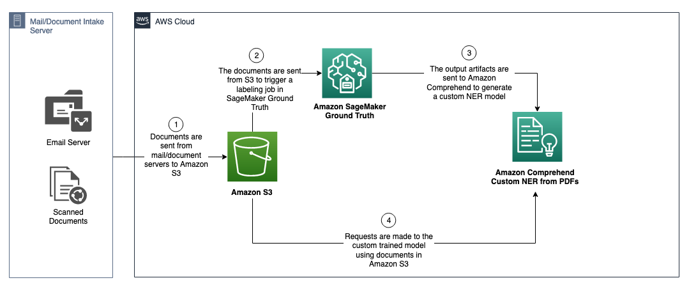

## Extract Legal Entities from Insurance Documents using Amazon Comprehend Named Entity Recognition

In this repository we will demonstrate how customers can use Amazon Comprehend customer NER for documents in their native format. The benefit of using this method is that the custom entity recognition model leverages both the natural language and positional information (e.g., coordinates) of the text to accurately extract custom entities that previously may be impacted when flattening a document, demonstrated in our example above where we are impacted by overlapping entity values. For this post we will be using a dataset of legal requisition/demand letters for Life Insurance however this approach can be used across any industry & document which may benefit from spatial data in NER training. A sample reference architecture is depicted below. 





To get started:

Clone the required files by

```
git clone https://github.com/aws-samples/aws-legal-entity-extraction.git
```

Follow the instructions from the blog provided : https://aws.amazon.com/blogs/machine-learning/extract-entities-from-insurance-documents-using-amazon-comprehend-named-entity-recognition/


## Security

See [CONTRIBUTING](CONTRIBUTING.md#security-issue-notifications) for more information.

## License

This library is licensed under the MIT-0 License. See the LICENSE file.

